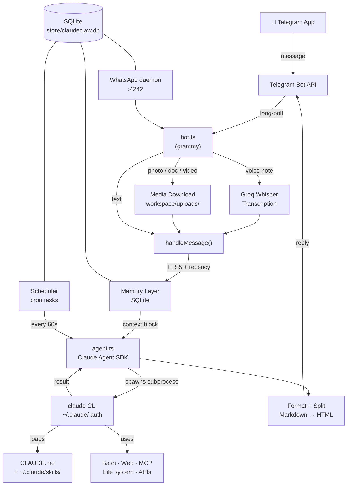

# ClaudeClaw

> Your Claude Code CLI, delivered to your phone via Telegram.

ClaudeClaw is not a chatbot wrapper. It spawns the actual `claude` CLI on your Mac or Linux machine as a subprocess and pipes the result back to your Telegram chat. Because it runs real Claude Code — with your `CLAUDE.md`, your installed skills, and full tool access — everything that works in your terminal works from your phone.

---

## Architecture



---

## What you get out of the box

The only hard requirements are a Telegram bot token and Claude Code logged in on your machine. Everything else is optional.

### Zero extra API keys

With just `TELEGRAM_BOT_TOKEN` and `ALLOWED_CHAT_ID`:

| Feature | Works? | Notes |
|---------|--------|-------|
| Text messaging | ✅ | Full Claude Code, all tools |
| Photos | ✅ | Claude reads and analyzes via its Read tool |
| Documents | ✅ | PDF, code, text — anything Claude Code can read |
| SQLite memory | ✅ | Auto-initialized on first run |
| Session persistence | ✅ | Context carries across messages |
| Scheduled tasks | ✅ | Ask Claude to run anything on a cron schedule |
| All your skills | ✅ | Every skill in `~/.claude/skills/` auto-loads |
| WhatsApp (`/wa`) | ✅ | Needs `wa-daemon` running, no API key |
| Voice input | ❌ | Needs `GROQ_API_KEY` |
| Voice output | ❌ | Needs `ELEVENLABS_API_KEY` + `ELEVENLABS_VOICE_ID` |
| Video analysis | ❌ | Needs `GOOGLE_API_KEY` |

---

## Database — auto-initialized, nothing to configure

ClaudeClaw ships with a full SQLite database that **creates itself automatically** on first run. No migrations to run, no setup commands, no external database server. The file lives at `store/claudeclaw.db` and is created the moment you start the bot.

The database runs in WAL (Write-Ahead Logging) mode for concurrent read performance.

### Schema

```sql
-- Claude Code session IDs, one per Telegram chat
sessions (
  chat_id    TEXT PRIMARY KEY,
  session_id TEXT NOT NULL,
  updated_at TEXT NOT NULL
)

-- Persistent memory with FTS5 full-text search
memories (
  id          INTEGER PRIMARY KEY AUTOINCREMENT,
  chat_id     TEXT NOT NULL,
  topic_key   TEXT,
  content     TEXT NOT NULL,
  sector      TEXT NOT NULL DEFAULT 'semantic',  -- 'semantic' | 'episodic'
  salience    REAL NOT NULL DEFAULT 1.0,          -- decays daily, deleted at < 0.1
  created_at  INTEGER NOT NULL,
  accessed_at INTEGER NOT NULL
)

-- Full-text search index over memories.content
memories_fts (virtual FTS5 table, auto-synced via triggers)

-- Cron-scheduled autonomous tasks
scheduled_tasks (
  id          TEXT PRIMARY KEY,
  prompt      TEXT NOT NULL,
  schedule    TEXT NOT NULL,   -- cron expression
  next_run    INTEGER NOT NULL,
  last_run    INTEGER,
  last_result TEXT,
  status      TEXT NOT NULL DEFAULT 'active',  -- 'active' | 'paused'
  created_at  INTEGER NOT NULL
)

-- Maps forwarded Telegram message IDs back to WhatsApp chats (for reply routing)
wa_message_map (
  telegram_msg_id INTEGER PRIMARY KEY,
  wa_chat_id      TEXT NOT NULL,
  contact_name    TEXT NOT NULL,
  created_at      INTEGER NOT NULL
)

-- Outbox queue for outgoing WhatsApp messages
wa_outbox (
  id         INTEGER PRIMARY KEY AUTOINCREMENT,
  to_chat_id TEXT NOT NULL,
  body       TEXT NOT NULL,
  created_at INTEGER NOT NULL,
  sent_at    INTEGER          -- NULL until delivered
)

-- Incoming WhatsApp message history
wa_messages (
  id           INTEGER PRIMARY KEY AUTOINCREMENT,
  chat_id      TEXT NOT NULL,
  contact_name TEXT NOT NULL,
  body         TEXT NOT NULL,
  timestamp    INTEGER NOT NULL,
  is_from_me   INTEGER NOT NULL DEFAULT 0,
  created_at   INTEGER NOT NULL
)
```

### Inspecting the database directly

```bash
# Open the DB
sqlite3 store/claudeclaw.db

# Useful queries
SELECT * FROM memories ORDER BY accessed_at DESC LIMIT 10;
SELECT * FROM scheduled_tasks;
SELECT * FROM sessions;
SELECT COUNT(*) FROM wa_messages;
SELECT * FROM wa_outbox WHERE sent_at IS NULL;  -- pending outbox

.quit
```

### Runtime directories

Both are auto-created on startup — you don't need to create them manually:

```
store/               SQLite DB, PID file, WhatsApp session data
workspace/uploads/   Downloaded Telegram media (photos, docs, videos)
                     Auto-cleaned after 24 hours
```

---

## API keys — what each does, cost, and alternatives

### Telegram Bot Token (required)

**What it does:** Connects ClaudeClaw to Telegram as a bot.

**How to get it:** Message [@BotFather](https://t.me/botfather) → `/newbot` → follow the prompts. Free, instant.

---

### Groq API Key — voice input (optional)

**What it does:** Transcribes your Telegram voice notes using Whisper before passing them to Claude. Without this, sending a voice note returns an error message.

**How to get it:** [console.groq.com](https://console.groq.com) — free tier is more than enough for personal use.

**Model used:** `whisper-large-v3`

**Alternatives:**

| Service | Cost | Notes |
|---------|------|-------|
| **Groq** (default) | Free tier | Fast, easy, no card needed |
| OpenAI Whisper | ~$0.006/min | Swap `transcribeAudio()` in `src/voice.ts` |
| AssemblyAI | Free tier | More features, slightly more setup |
| Local Whisper.cpp | Free | Runs on your Mac, no API — requires code change |

---

### ElevenLabs — voice output (optional)

**What it does:** Converts Claude's text responses to spoken audio using a cloned voice. Both `ELEVENLABS_API_KEY` and `ELEVENLABS_VOICE_ID` must be set for this to work.

**How to get it:** [elevenlabs.io](https://elevenlabs.io) — clone your own voice under "Voice Lab", copy the Voice ID string.

**Model:** `eleven_turbo_v2_5` (fastest, lowest cost)

**Settings:**
```
stability: 0.5        higher = more consistent but robotic
similarity_boost: 0.75  higher = closer to source but can distort
```
Tweak these in `src/voice.ts` if the cloned voice sounds off. Most people find 0.5/0.75 the sweet spot.

**Alternatives:**

| Service | Cost | Notes |
|---------|------|-------|
| **ElevenLabs** (default) | Free tier + paid | Best voice cloning quality |
| OpenAI TTS | ~$0.015/1k chars | Good quality, no cloning |
| Google Cloud TTS | Free tier | More robotic |
| Coqui TTS | Free, open source | Run locally — requires code change |

---

### Google API Key — video analysis (optional)

**What it does:** When you send a video to the bot, ClaudeClaw downloads it and instructs Claude to analyze it using the `gemini-api-dev` skill with this key. Without it, Claude receives the video file path but can't understand the content.

**How to get it:** [aistudio.google.com](https://aistudio.google.com) → "Get API key" — free tier available.

**No alternatives** — Gemini is the only model that handles arbitrary video natively without additional setup.

---

### Anthropic API Key (optional)

**What it does:** Bypasses your Claude Max subscription and bills per-token via the API Console instead. Without this, ClaudeClaw uses whatever `claude login` auth is on your machine.

**When to use it:** Always-on server deployments, or if you want no ambiguity about billing. The Max plan's usage limits assume "ordinary individual usage" — a 24/7 always-on assistant can burn through limits faster than Anthropic expects. An API key removes that concern entirely.

**How to get it:** [console.anthropic.com](https://console.anthropic.com)

---

## Default behaviors — read this before you start

These are the behaviors that trip people up.

### Voice notes → text response (default)

When you send a voice note, ClaudeClaw:
1. Downloads the audio from Telegram
2. Transcribes it with Groq Whisper
3. Passes the transcribed text to Claude as `[Voice transcribed]: your message`
4. **Responds in text by default** — not audio

This is intentional. Most of the time you send a quick voice note and want a clean text reply you can read, not an audio file back.

**To get a voice response from a specific voice note**, say one of these phrases anywhere in your message:

```
"respond with voice"     "respond via voice"     "respond in voice"
"send me a voice note"   "send a voice back"      "voice reply"
"reply with voice"       "reply via voice"
```

**To permanently toggle voice responses on** for all messages (text and voice), send `/voice` to the bot. Send it again to toggle off. Resets on bot restart.

If ElevenLabs TTS fails for any reason, it automatically falls back to a text reply.

### Voice pipeline end to end

```
You send a voice note
  │
  ▼
Telegram .oga file → renamed to .ogg (Groq requires this)
  │
  ▼
Groq Whisper API → transcribed text
  │
  ▼
Check for voice-back trigger phrases
  │
  ├── phrase found → Claude runs → ElevenLabs TTS → voice reply
  └── no phrase   → Claude runs → text reply (formatted as Telegram HTML)
```

### Photos → immediate analysis

Send any photo, with or without a caption. Claude analyzes it using the Read tool. Caption becomes the instruction — no caption means Claude describes what it sees.

### Documents → immediate processing

Send any file and Claude reads it. Works on PDFs, code, markdown, CSV, plain text — anything the Read tool can open. Caption becomes the instruction.

### Videos → Gemini analysis

Send a video and ClaudeClaw downloads it to `workspace/uploads/`, then instructs Claude to use the `gemini-api-dev` skill with your `GOOGLE_API_KEY` to analyze the content. If no key is set, Claude receives the file path but can't understand it.

Video notes (Telegram's circular format) go through the same flow.

Telegram bots are limited to downloading files under 20MB.

### Sessions persist until you clear them

Claude Code sessions carry full context across messages via a stored session ID in SQLite. Reference something from 20 messages ago — Claude knows. Use `/newchat` to start completely fresh. Use `/forget` to clear the session (memories decay over time via the salience system).

### Skills load automatically

Every skill in `~/.claude/skills/` loads on every session via `settingSources: ['project', 'user']`. No configuration needed — if the skill is installed on your machine, it's available. Reference it explicitly (`/gmail check inbox`) or describe what you want and Claude routes to the right skill automatically if you've listed it in `CLAUDE.md`.

### Markdown → Telegram HTML conversion

Claude's responses are in Markdown. Telegram doesn't render standard Markdown — it uses its own HTML subset (`<b>`, `<i>`, `<code>`, `<pre>`, `<a>`). ClaudeClaw converts automatically:

| Markdown | Telegram |
|----------|----------|
| `**bold**` | `<b>bold</b>` |
| `*italic*` | `<i>italic</i>` |
| `` `code` `` | `<code>code</code>` |
| ` ```block``` ` | `<pre>block</pre>` |
| `# Heading` | `<b>Heading</b>` |
| `- [ ] task` | `☐ task` |
| `- [x] done` | `✓ done` |
| `~~strike~~` | `<s>strike</s>` |
| `---` | removed |

Responses longer than 4096 characters are split at newlines and sent as multiple messages.

### Typing indicator while Claude thinks

ClaudeClaw sends a "typing..." action to Telegram every 4 seconds while Claude is working. Telegram's typing action expires after ~5 seconds, so this keeps it continuous. This is the only visible sign the bot is alive during long agent runs.

### PID lock — one instance at a time

ClaudeClaw writes its process ID to `store/claudeclaw.pid` on startup. If another instance is running, the old one receives SIGTERM and is given 1 second to shut down before the new one starts. This prevents the "409 Conflict: terminated by other getUpdates request" Telegram error from running two instances.

---

## Memory system

Three layers of context are always active:

### 1. Session resumption
Claude Code sessions persist via a stored session ID. Each new message resumes the same session — Claude carries full tool use history, working context, and reasoning without you re-sending anything.

### 2. SQLite + FTS5 memory
Every conversation turn is saved with a salience score. Two sectors:

- **Semantic** — messages containing: `my`, `I am`, `I'm`, `I prefer`, `remember`, `always`, `never`. Decays slowly.
- **Episodic** — all other meaningful messages (over 20 chars, not commands). Decays faster.

Short messages (≤20 chars) and `/commands` are skipped — not worth storing.

Salience mechanics:
- Starts at `1.0`
- Increases by `0.1` (max `5.0`) when a memory is retrieved and used
- Decreases by `2%` daily for all memories older than 24 hours
- Deleted when salience drops below `0.1`

### 3. Context injection
Before each message, two searches run in parallel and the results are deduplicated and prepended:

1. **FTS5 keyword search** — matches your message against stored content using prefix matching, returns top 3
2. **Recency fallback** — 5 most recently accessed memories

Claude sees this block at the top of every message:
```
[Memory context]
- you prefer short bullet replies (semantic)
- working on the YouTube channel rebrand (episodic)
[End memory context]
```

```bash
/memory    # see what's currently stored
/forget    # clear session (memories decay naturally over time)
```

---

## Scheduled tasks

Ask Claude in plain language:

```
Every Monday at 9am, summarize AI news from the past week and send it to me
Every weekday at 8am, check my calendar and inbox and give me a briefing
Every 4 hours, check for new emails from clients and flag anything urgent
First of the month, pull my Skool community stats and tell me what changed
```

Claude creates tasks by running the built-in schedule CLI via the Bash tool. Tasks are stored in the `scheduled_tasks` table and the scheduler checks for due ones every 60 seconds. Results are sent directly to your Telegram chat.

Manage tasks from the chat or directly:

```bash
node dist/schedule-cli.js list
node dist/schedule-cli.js create "summarize AI news" "0 9 * * 1"
node dist/schedule-cli.js pause <id>
node dist/schedule-cli.js resume <id>
node dist/schedule-cli.js delete <id>
```

**Cron patterns:**

| Pattern | Meaning |
|---------|---------|
| `0 9 * * 1` | Every Monday at 9am |
| `0 8 * * 1-5` | Every weekday at 8am |
| `0 9 1 * *` | First of the month at 9am |
| `0 */4 * * *` | Every 4 hours |
| `0 18 * * 0` | Every Sunday at 6pm |
| `0 7 * * *` | Every day at 7am |

---

## WhatsApp

No API key needed. ClaudeClaw connects to your existing WhatsApp account via [whatsapp-web.js](https://github.com/pedroslopez/whatsapp-web.js) and Linked Devices.

### Start the daemon

```bash
npx tsx scripts/wa-daemon.ts
```

A QR code prints to the terminal. Open WhatsApp → Settings → Linked Devices → scan within 30 seconds. The session is saved to `store/waweb/` and persists across restarts — you only scan once.

The daemon runs independently from ClaudeClaw on:
- **HTTP API** `:4242` — `/status`, `/send`, `/download-media`
- **CDP** `:9222` — Puppeteer's Chrome DevTools Protocol for live access

### Use it from Telegram

```
/wa                      list 5 most recent chats (unread first)
1                        open chat #1, show last 10 messages
r <text>                 reply to the open chat
r 2 <text>               quick-reply to chat #2 without opening it
/wa                      go back to list
```

### Incoming messages

When someone messages you on WhatsApp, ClaudeClaw sends a brief ping to Telegram:

```
📱 John Smith — new message
/wa to view & reply
```

No content is forwarded automatically. You pull it on demand. This is intentional — keeps your Telegram clean and gives you control over what you see and when.

### Outbox

Messages you send via the bot are queued in the `wa_outbox` SQLite table and delivered by the daemon's outbox poller (runs every 3 seconds). If the daemon is temporarily down when you send, the message will be delivered when it comes back up.

---

## Commands

| Command | What it does |
|---------|-------------|
| `/start` | Confirm the bot is online |
| `/chatid` | Get your Telegram chat ID (setup only) |
| `/newchat` | Start a fresh Claude Code session |
| `/voice` | Toggle voice response mode on/off |
| `/memory` | Show recent memories for this chat |
| `/forget` | Clear current session |
| `/wa` | Open the WhatsApp interface |

Any `/command` not in this list is passed directly to Claude, which routes it to the matching skill (e.g. `/gmail`, `/todo`, `/linkedin-post`, `/maestro`).

---

## Available scripts

```bash
npm run setup     # Interactive setup wizard (cross-platform)
npm run status    # Check environment, bot token, DB, and service status
npm run build     # Compile TypeScript to dist/
npm start         # Run compiled bot (production)
npm run dev       # Run directly with tsx (development, skips build)
npm test          # Run test suite (vitest)
npm run typecheck # Type-check without compiling
```

### `npm run status`

Checks everything at a glance — Node version, Claude CLI, bot token validity (live API check), chat ID, voice keys, launchd service status, and memory DB size:

```
  ✓  Node v22.3.0
  ✓  Claude CLI 1.0.12
  ✓  Bot token: @YourBotName
  ✓  Chat ID: 1234567890
  ✓  Voice STT: Groq (configured)
  ⚠  Voice TTS: not configured
  ✓  Service: running (PID 12345)
  ✓  Memory DB: 47 memories stored
  ─────────────────
  All systems go.
```

### `scripts/notify.sh`

Sends a Telegram message from the shell. Used by Claude for mid-task status updates on long operations. Reads credentials from `.env` automatically.

```bash
bash scripts/notify.sh "Building... ⚙️"
bash scripts/notify.sh "Done ✅"
```

Claude uses this automatically for heavy tasks (builds, restarts, long scrapes). For quick tasks it skips the notification.

---

## Quick start

### Prerequisites

- Node.js 20+
- Claude Code installed and authenticated: `npm i -g @anthropic-ai/claude-code && claude login`
- A Telegram bot token from [@BotFather](https://t.me/botfather)

### Install

```bash
git clone https://github.com/earlyaidopters/claudeclaw.git
cd claudeclaw
npm install
npm run build
```

### Configure

```bash
cp .env.example .env
# Edit .env — add TELEGRAM_BOT_TOKEN at minimum
```

### Run the setup wizard

```bash
npm run setup
```

Checks your environment, validates your bot token, walks through every API key with direct links, and installs a background service (launchd on macOS, systemd on Linux, PM2 instructions for Windows).

### Or let Claude install it

Clone the repo, `cd` into it, run `claude`, and paste:

```
I just cloned ClaudeClaw. Please read README.md and walk me through
the complete setup — install deps, configure .env, help me get the
API keys I want, and set up the background service for my OS.
```

---

## Configuration reference

| Variable | Required | Description |
|----------|----------|-------------|
| `TELEGRAM_BOT_TOKEN` | Yes | From [@BotFather](https://t.me/botfather) |
| `ALLOWED_CHAT_ID` | Yes | Your Telegram chat ID — send `/chatid` to get it |
| `ANTHROPIC_API_KEY` | No | Pay-per-token via API instead of Max subscription |
| `GROQ_API_KEY` | No | Voice input — [console.groq.com](https://console.groq.com) |
| `ELEVENLABS_API_KEY` | No | Voice output — [elevenlabs.io](https://elevenlabs.io) |
| `ELEVENLABS_VOICE_ID` | No | Your ElevenLabs voice ID (the ID string, not the name) |
| `GOOGLE_API_KEY` | No | Gemini video analysis — [aistudio.google.com](https://aistudio.google.com) |
| `CLAUDE_CODE_OAUTH_TOKEN` | No | Override which Claude account is used |

---

## Running as a background service

### macOS (launchd)

```bash
npm run setup    # handles installation automatically
```

Logs: `tail -f /tmp/claudeclaw.log`

### Linux (systemd)

```bash
npm run setup    # detects Linux, installs systemd user service
```

Or manually — `~/.config/systemd/user/claudeclaw.service`:

```ini
[Unit]
Description=ClaudeClaw Telegram Bot
After=network.target

[Service]
Type=simple
WorkingDirectory=/home/youruser/claudeclaw
ExecStart=/usr/bin/node dist/index.js
Restart=always
RestartSec=10
StandardOutput=journal
StandardError=journal
Environment=NODE_ENV=production
Environment=HOME=/home/youruser

[Install]
WantedBy=default.target
```

```bash
systemctl --user daemon-reload
systemctl --user enable --now claudeclaw
journalctl --user -u claudeclaw -f
```

### Windows

Use WSL2 (recommended) and follow the Linux steps. Keep `~/.claude/` inside the WSL2 filesystem.

For native Windows without WSL2:
```bash
npm install -g pm2
pm2 start dist/index.js --name claudeclaw
pm2 save && pm2 startup
```

---

## Customizing the ASCII art

The startup banner is in `banner.txt` at the project root. Replace it with anything — plain text, different ASCII art, leave it empty. Read fresh on every start.

---

## Customizing behavior (CLAUDE.md)

`CLAUDE.md` is loaded into every Claude Code session and is the only file you need to edit. Key sections:

**Personality rules** — Specific beats vague. "No em dashes, ever" and "don't narrate what you're about to do, just do it" change behavior on every message.

**Who you are** — What you actually do, your projects, your context. The more specific, the less you have to explain per message.

**Your environment** — File paths Claude should be able to reach without being told (Obsidian vault, project directories, etc.).

**Skills table** — Maps skill names to trigger phrases so Claude auto-invokes them.

**Message format** — How responses should look in Telegram.

---

## Compliance with Anthropic's Terms of Service

On February 19, 2026, Anthropic published their [Legal and Compliance page](https://docs.anthropic.com/en/docs/legal-and-compliance) banning the use of OAuth tokens in third-party tools. **ClaudeClaw is not affected.** Here's why.

### What's banned

Tools like OpenClaw intercepted your OAuth session, extracted the token, and made direct API calls with it from third-party code — impersonating Claude Code without running it.

### Why ClaudeClaw is different

`@anthropic-ai/claude-agent-sdk`'s `query()` function spawns the `claude` binary as a child process. That subprocess manages its own OAuth from `~/.claude/`. ClaudeClaw never reads or transmits your token. It runs Claude Code and reads the output — functionally identical to `claude -p "message"` in a terminal, which is explicitly documented and supported by Anthropic.

| | ClaudeClaw | Token-extraction tools |
|---|---|---|
| Runs the official `claude` CLI | ✅ | ❌ |
| OAuth stays in `~/.claude/` | ✅ | ❌ |
| Uses Anthropic-published SDK | ✅ | ❌ |
| Single-user, personal machine | ✅ | ❌ |
| Anthropic telemetry intact | ✅ | ❌ |

For server/multi-user deployments, set `ANTHROPIC_API_KEY` to use pay-per-token billing instead.

---

## Troubleshooting

**Bot doesn't respond**
- Check `ALLOWED_CHAT_ID` matches the number from `/chatid`
- Check logs: `tail -f /tmp/claudeclaw.log`
- Run `npm run status` for a full health check
- Verify Claude is still authenticated: `claude --version`

**Voice notes return an error**
- `GROQ_API_KEY` must be in `.env` and the bot restarted after adding it

**Voice responses not working**
- Both `ELEVENLABS_API_KEY` and `ELEVENLABS_VOICE_ID` must be set
- The Voice ID is a string like `21m00Tcm4TlvDq8ikWAM`, not the voice name
- Check `/voice` mode is on, or say "respond with voice" in the message

**WhatsApp not connecting**
- Confirm `scripts/wa-daemon.ts` is running in a separate terminal
- The QR code expires after ~30 seconds — kill and restart the daemon if it expired
- Session is saved to `store/waweb/` — delete this folder to force re-authentication

**"409 Conflict: terminated by other getUpdates request"**
- Another instance is running. Kill it: `kill $(cat store/claudeclaw.pid)` then restart

**Session feels stale or confused**
- Send `/newchat` to start a fresh session

**Media downloads fail**
- Telegram bots are limited to 20MB file downloads — this is a Telegram API constraint, not a ClaudeClaw limit

---

## Project structure

```
claudeclaw/
├── src/
│   ├── index.ts          Entrypoint — banner, PID lock, DB init, bot, scheduler
│   ├── bot.ts            Telegram message handling, WA state machine, formatting
│   ├── agent.ts          Claude Agent SDK — spawns claude subprocess
│   ├── db.ts             SQLite schema, all DB functions
│   ├── memory.ts         2-layer memory: FTS5 search + salience decay
│   ├── scheduler.ts      Cron task runner (60s tick)
│   ├── voice.ts          Groq STT + ElevenLabs TTS
│   ├── media.ts          Telegram file downloads + 24h cleanup
│   ├── whatsapp.ts       whatsapp-web.js client interface + outbox poller
│   ├── config.ts         Env config (never pollutes process.env)
│   ├── env.ts            Custom .env parser
│   └── schedule-cli.ts   CLI for managing scheduled tasks
│
├── scripts/
│   ├── wa-daemon.ts      Standalone WA daemon (HTTP :4242, CDP :9222)
│   ├── notify.sh         Send Telegram message from shell (reads from .env)
│   ├── setup.ts          Interactive setup wizard (macOS / Linux / Windows)
│   └── status.ts         Health check — env, bot, DB, service
│
├── banner.txt            Startup ASCII art — replace freely
├── CLAUDE.md             Assistant personality and context — make this yours
├── claudeclaw.plist      macOS LaunchAgent template
├── store/                Runtime data — gitignored
│   ├── claudeclaw.db     SQLite database
│   ├── claudeclaw.pid    PID lock file
│   └── waweb/            WhatsApp session cache
└── workspace/
    └── uploads/          Downloaded Telegram media (auto-cleaned after 24h)
```

---

## Other channels

The same `runAgent()` pattern in `src/agent.ts` works across any messaging channel:

- **[NanoClaw](https://github.com/qwibitai/nanoclaw)** — WhatsApp, isolated Linux containers
- **[OpenClaw](https://github.com/openclaw/openclaw)** — 10+ channels: Telegram, WhatsApp, Slack, Discord, iMessage, Signal, and more
- **[TinyClaw](https://github.com/jlia0/tinyclaw)** — ~400 lines of shell, Claude Code + tmux, zero dependencies

---

## License

MIT
