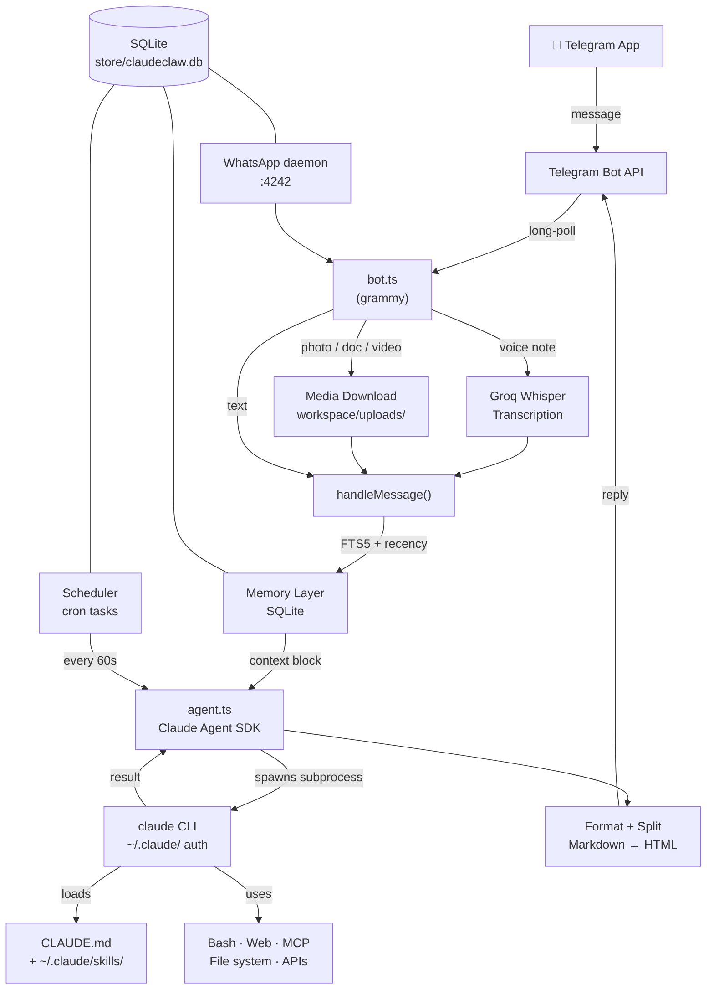

# ClaudeClaw

> Your Claude Code CLI, delivered to your phone via Telegram.

ClaudeClaw is not a chatbot wrapper. It spawns the actual `claude` CLI on your Mac or Linux machine and pipes the result back to your Telegram chat. Everything that works in your terminal — your skills, your tools, your context — works from your phone.

---

## Get started

Follow these steps in order. The whole thing takes about 5 minutes.

---

### Step 1 — What you need before anything else

| Requirement | Notes |
|-------------|-------|
| **Node.js 20+** | Check: `node --version`. Download at [nodejs.org](https://nodejs.org) |
| **Claude Code CLI** | Install: `npm i -g @anthropic-ai/claude-code` |
| **Claude account** | Log in: `claude login` (free, Pro, or Max plan) |
| **Telegram account** | Any existing account works |

That's it for hard requirements. Everything else (voice, video, WhatsApp) is optional and the setup wizard will ask about them.

---

### Step 2 — Create a Telegram bot

You need a bot token from Telegram. This is what ClaudeClaw uses to send and receive messages.

1. Open Telegram and search for **@BotFather**
2. Send `/newbot`
3. Follow the prompts — give it a name and a username (e.g. `MyAssistantBot`)
4. Copy the token BotFather gives you — it looks like `1234567890:AAFxxxxxxx`

Keep this token handy for the next step.

---

### Step 3 — Clone and install

```bash
git clone https://github.com/earlyaidopters/claudeclaw.git
cd claudeclaw
npm install
```

---

### Step 4 — Run the setup wizard

```bash
npm run setup
```

The wizard walks you through everything interactively:

- Checks your environment (Node, Claude CLI, builds if needed)
- Asks which features you want — voice input, voice output, video analysis, WhatsApp
- Offers to clone other Claw projects for inspiration (NanoClaw, OpenClaw, TinyClaw)
- Opens your editor to personalize `CLAUDE.md`
- Lists the skills you'll want to install and where to get them
- Prompts for API keys **only for the features you selected**
- Installs a background service (launchd on macOS, systemd on Linux, PM2 on Windows)

> **Prefer to let Claude handle it?** After cloning, `cd` into the repo, run `claude`, and paste:
> ```
> I just cloned ClaudeClaw. Please read README.md and set me up completely —
> install deps, configure .env, help me get any API keys I need, and set up
> the background service for my OS.
> ```

---

### Step 5 — Get your Telegram chat ID

Your chat ID locks the bot to you — no one else can use it.

1. Start the bot: `npm start`
2. Open Telegram and message your bot
3. Send `/chatid`
4. The bot replies with a number — that's your chat ID
5. Add it to `.env`:
   ```
   ALLOWED_CHAT_ID=your_number_here
   ```
6. Restart: stop the bot (Ctrl+C) and run `npm start` again

> The setup wizard does this step automatically if you run `npm run setup` before starting.

---

### Step 6 — Send your first message

With the bot running, send any message. Try:

```
What can you do?
```

or

```
Check my calendar for today
```

or just start talking. Claude Code is running on your machine — it has access to your files, the web, and every skill you've installed.

---

### Step 7 — Run as a background service

You probably want ClaudeClaw running automatically, not manually in a terminal.

**macOS** — the setup wizard installs a launchd agent. Or manually:
```bash
# After running npm run setup, it's already installed.
# Logs:
tail -f /tmp/claudeclaw.log
```

**Linux** — the setup wizard installs a systemd user service:
```bash
systemctl --user status claudeclaw
journalctl --user -u claudeclaw -f
```

**Windows** — use WSL2 (recommended) and follow the Linux steps, or:
```bash
npm install -g pm2
pm2 start dist/index.js --name claudeclaw
pm2 save && pm2 startup
```

---

### Step 8 — Check everything is healthy

```bash
npm run status
```

Output looks like:
```
  ✓  Node v22.3.0
  ✓  Claude CLI 1.0.12
  ✓  Bot token: @YourBotName
  ✓  Chat ID: 1234567890
  ✓  Voice STT: Groq (configured)
  ⚠  Voice TTS: not configured
  ✓  Service: running (PID 12345)
  ✓  Memory DB: 47 memories stored
  ─────────────────
  All systems go.
```

---

## What's included

### Zero extra API keys needed

With just `TELEGRAM_BOT_TOKEN` and `ALLOWED_CHAT_ID`:

| Feature | Works? | Notes |
|---------|--------|-------|
| Text messaging | ✅ | Full Claude Code, all tools |
| Photos | ✅ | Claude reads and analyzes them |
| Documents | ✅ | PDF, code, text — anything Claude Code can open |
| SQLite memory | ✅ | Auto-initialized on first run, nothing to configure |
| Session persistence | ✅ | Context carries across every message |
| Scheduled tasks | ✅ | Ask Claude to run anything on a cron schedule |
| All your skills | ✅ | Every skill in `~/.claude/skills/` auto-loads |
| WhatsApp (`/wa`) | ✅ | No API key, but needs the wa-daemon running |
| Voice input | ❌ | Needs `GROQ_API_KEY` |
| Voice output | ❌ | Needs `ELEVENLABS_API_KEY` + `ELEVENLABS_VOICE_ID` |
| Video analysis | ❌ | Needs `GOOGLE_API_KEY` + `gemini-api-dev` skill |

---

## API keys — what each does and alternatives

### Telegram Bot Token (required)

**Get it:** [@BotFather](https://t.me/botfather) → `/newbot` — free, instant.

---

### Groq — voice input (optional)

**What it does:** Transcribes your voice notes using Whisper before passing them to Claude.

**Get it:** [console.groq.com](https://console.groq.com) — free tier, no card needed.

**Model:** `whisper-large-v3`

| Alternative | Cost | Notes |
|-------------|------|-------|
| **Groq** (default) | Free | Fastest to set up |
| OpenAI Whisper | ~$0.006/min | Swap `transcribeAudio()` in `src/voice.ts` |
| AssemblyAI | Free tier | More features |
| Local Whisper.cpp | Free | No API, runs on your Mac — needs code change |

---

### ElevenLabs — voice output (optional)

**What it does:** Converts Claude's responses to audio in your cloned voice.

**Get it:** [elevenlabs.io](https://elevenlabs.io) → clone your voice under "Voice Lab" → copy the Voice ID string.

**Model:** `eleven_turbo_v2_5`

**Tuning:** Edit `src/voice.ts` if the cloned voice sounds off:
```
stability: 0.5        (higher = more consistent but robotic)
similarity_boost: 0.75  (higher = closer to you but can distort)
```

| Alternative | Cost | Notes |
|-------------|------|-------|
| **ElevenLabs** (default) | Free tier + paid | Best cloning quality |
| OpenAI TTS | ~$0.015/1k chars | Good quality, no cloning |
| Google Cloud TTS | Free tier | More robotic |
| Coqui TTS | Free, open source | Run locally — needs code change |

---

### Google — video analysis (optional)

**What it does:** Analyzes videos you send using Gemini. Also handles images, audio, function calling, structured output, and code execution via the `gemini-api-dev` skill.

**Get it:** [aistudio.google.com](https://aistudio.google.com) → "Get API key" — free tier.

**Skill to install:** The `gemini-api-dev` skill is published by Google at:
- Skill docs: [github.com/google-gemini/gemini-skills/.../gemini-api-dev/SKILL.md](https://github.com/google-gemini/gemini-skills/blob/main/skills/gemini-api-dev/SKILL.md)
- Repo: [github.com/google-gemini/gemini-skills](https://github.com/google-gemini/gemini-skills)
- Install: copy the `gemini-api-dev` folder into `~/.claude/skills/`

The skill reads `GOOGLE_API_KEY` from the environment automatically.

---

### Anthropic API key (optional)

**What it does:** Bypasses your Max subscription and uses pay-per-token billing instead.

**When to use it:** Server deployments, or if you want zero ambiguity about billing. The Max plan assumes "ordinary individual usage" — an always-on bot can hit limits faster than expected.

**Get it:** [console.anthropic.com](https://console.anthropic.com)

---

## Default behaviors

### Voice notes → text reply (default)

Sending a voice note transcribes it and executes it as a command. **The reply comes back as text by default** — not audio.

To get a voice reply back from a specific voice note, say one of these anywhere in your message:
```
"respond with voice"    "respond via voice"    "respond in voice"
"send me a voice note"  "send a voice back"    "voice reply"
"reply with voice"      "reply via voice"
```

To toggle voice replies on permanently for all messages, send `/voice`. Send it again to turn it off. Resets on restart.

If ElevenLabs fails for any reason, it falls back to text automatically.

### Voice pipeline

```
Voice note sent
  ↓
.oga file downloaded → renamed .ogg (Groq requires this)
  ↓
Groq Whisper → transcribed text
  ↓
Check for voice-back trigger phrases
  ├── found → Claude runs → ElevenLabs TTS → audio reply
  └── not found → Claude runs → text reply
```

### Photos → analyzed immediately

Send a photo with or without a caption. Caption becomes the instruction. No caption — Claude describes what it sees.

### Documents → read and processed

Any file Claude Code can open: PDFs, code, markdown, CSV, plain text. Caption is the instruction.

### Videos → Gemini analysis

ClaudeClaw downloads the video to `workspace/uploads/` and tells Claude to analyze it with the `gemini-api-dev` skill. Without `GOOGLE_API_KEY`, Claude receives the file path but can't understand the content. Telegram caps downloads at 20MB.

### Sessions persist

Claude Code sessions carry full context across messages. Reference something from earlier — Claude knows. Send `/newchat` to start fresh.

### Skills load automatically

Every skill in `~/.claude/skills/` loads on every session. Call them directly (`/gmail check inbox`) or describe what you want — Claude routes automatically if you've listed the skill in `CLAUDE.md`.

---

## Bot commands

| Command | What it does |
|---------|-------------|
| `/start` | Confirm the bot is online |
| `/chatid` | Get your Telegram chat ID |
| `/newchat` | Start a fresh Claude Code session |
| `/voice` | Toggle voice response mode on/off |
| `/memory` | Show recent memories for this chat |
| `/forget` | Clear current session |
| `/wa` | Open the WhatsApp interface |

Any other `/command` passes through to Claude and routes to the matching skill.

---

## WhatsApp (optional)

No API key needed. Uses your existing WhatsApp account via Linked Devices.

### Start the daemon

```bash
npx tsx scripts/wa-daemon.ts
```

A QR code prints. Open WhatsApp → Settings → Linked Devices → scan within 30 seconds. Session saves to `store/waweb/` — you only scan once.

### Use it from Telegram

```
/wa              list 5 most recent chats (unread first)
1                open chat #1, show last 10 messages
r <text>         reply to the open chat
r 2 <text>       quick-reply to chat #2 without opening it
```

### Incoming message notifications

When someone messages you on WhatsApp:
```
📱 John Smith — new message
/wa to view & reply
```

No content is forwarded automatically. You pull it on demand.

### How the outbox works

Messages you send via the bot go into a `wa_outbox` SQLite table. The daemon's outbox poller (every 3 seconds) picks them up and delivers them. If the daemon is temporarily down, messages queue and deliver when it comes back.

---

## Memory

Three layers of context are always active:

**Session resumption** — Claude Code sessions persist via a stored session ID. Claude carries full tool use history and reasoning across messages without re-sending anything.

**SQLite + FTS5 memory** — Each turn is saved with a salience score:
- **Semantic** (slow decay): messages with `my`, `I am`, `I prefer`, `remember`, `always`, `never`
- **Episodic** (faster decay): other meaningful messages over 20 characters

Salience starts at 1.0, increases when a memory is accessed, drops 2% daily, deleted below 0.1.

**Context injection** — Before each message, FTS5 keyword search (top 3) + 5 most recent memories are prepended as a `[Memory context]` block.

```
/memory    see what's stored
/forget    clear session
```

---

## Scheduled tasks

Tell Claude what you want, in plain language:

```
Every Monday at 9am, summarize AI news from the past week and send it to me
Every weekday at 8am, check my calendar and inbox and give me a briefing
Every 4 hours, check for new emails from clients and flag anything urgent
```

Claude creates and manages tasks via the built-in CLI. Manage them directly too:

```bash
node dist/schedule-cli.js list
node dist/schedule-cli.js create "summarize AI news" "0 9 * * 1"
node dist/schedule-cli.js pause <id>
node dist/schedule-cli.js delete <id>
```

| Cron pattern | Meaning |
|-------------|---------|
| `0 9 * * 1` | Every Monday at 9am |
| `0 8 * * 1-5` | Every weekday at 8am |
| `0 9 1 * *` | First of the month at 9am |
| `0 */4 * * *` | Every 4 hours |
| `0 7 * * *` | Every day at 7am |

---

## Database

ClaudeClaw ships with SQLite and **creates everything automatically on first run**. No migrations, no setup, no external database server. File lives at `store/claudeclaw.db`.

**Schema:**

```sql
sessions         -- Claude Code session IDs, one per chat
memories         -- Conversation memory with FTS5 search and salience decay
memories_fts     -- Virtual FTS5 table, auto-synced via triggers
scheduled_tasks  -- Cron-scheduled autonomous tasks
wa_message_map   -- Maps Telegram message IDs to WhatsApp chats
wa_outbox        -- Queued outgoing WhatsApp messages
wa_messages      -- Incoming WhatsApp message history
```

Inspect it directly:

```bash
sqlite3 store/claudeclaw.db

SELECT * FROM memories ORDER BY accessed_at DESC LIMIT 10;
SELECT * FROM scheduled_tasks;
SELECT * FROM sessions;
SELECT * FROM wa_outbox WHERE sent_at IS NULL;
```

---

## Customizing your assistant (CLAUDE.md)

`CLAUDE.md` is loaded into every Claude Code session. It's the personality and context file — the main thing to edit to make ClaudeClaw yours.

The sections that matter most:

**Personality rules** — Be specific. "No em dashes, ever" and "don't narrate what you're about to do, just do it" change behavior on every single message.

**Who you are** — What you do, your projects, your context. The more specific, the less you have to explain per message.

**Your environment** — File paths Claude should be able to reach without being told: your Obsidian vault, project directories, anything you reference regularly.

**Skills table** — Maps skill names to trigger phrases. This teaches Claude to invoke them automatically when you describe a task.

**Message format** — How responses should look in Telegram: tight and scannable, summary-first for long outputs, how to handle task lists.

---

## Customizing the ASCII art

The startup banner is in `banner.txt` at the project root. Replace it with anything or leave it empty. It's read fresh on every start.

---

## Skills to install

ClaudeClaw auto-loads every skill in `~/.claude/skills/`. These are the most useful:

**Core (recommended for everyone):**
- `gmail` — read, triage, send email
- `google-calendar` — schedule meetings, check availability
- `todo` — read tasks from Obsidian or text files
- `agent-browser` — browse the web, fill forms, scrape data
- `maestro` — run multiple tasks in parallel with sub-agents

**For video analysis:**
- `gemini-api-dev` — published by Google, handles video/image/audio/text
  - Docs: [github.com/google-gemini/gemini-skills/.../gemini-api-dev/SKILL.md](https://github.com/google-gemini/gemini-skills/blob/main/skills/gemini-api-dev/SKILL.md)
  - Install: copy the `gemini-api-dev` folder to `~/.claude/skills/`

Browse more: [github.com/anthropics/claude-code](https://github.com/anthropics/claude-code)

---

## Configuration reference

| Variable | Required | Description |
|----------|----------|-------------|
| `TELEGRAM_BOT_TOKEN` | Yes | From [@BotFather](https://t.me/botfather) |
| `ALLOWED_CHAT_ID` | Yes | Your chat ID — send `/chatid` to get it |
| `ANTHROPIC_API_KEY` | No | Pay-per-token instead of Max subscription |
| `GROQ_API_KEY` | No | Voice input — [console.groq.com](https://console.groq.com) |
| `ELEVENLABS_API_KEY` | No | Voice output — [elevenlabs.io](https://elevenlabs.io) |
| `ELEVENLABS_VOICE_ID` | No | Your ElevenLabs voice ID string |
| `GOOGLE_API_KEY` | No | Gemini — [aistudio.google.com](https://aistudio.google.com) |
| `CLAUDE_CODE_OAUTH_TOKEN` | No | Override which Claude account is used |

---

## Available scripts

```bash
npm run setup     # Interactive setup wizard
npm run status    # Health check — env, bot, DB, service
npm run build     # Compile TypeScript → dist/
npm start         # Run compiled bot (production)
npm run dev       # Run with tsx, no build needed (development)
npm test          # Run test suite (vitest)
npm run typecheck # Type-check without compiling
```

---

## Is this compliant with Anthropic's Terms of Service?

**Yes.** On February 19, 2026, Anthropic published their [Legal and Compliance page](https://docs.anthropic.com/en/docs/legal-and-compliance) banning OAuth tokens in third-party tools. ClaudeClaw is not affected.

**What's banned:** Tools that extract your OAuth token and make API calls with it from third-party code — impersonating Claude Code without running it (e.g. the old OpenClaw).

**Why ClaudeClaw is different:** `@anthropic-ai/claude-agent-sdk`'s `query()` spawns the `claude` binary as a child process. That subprocess manages its own OAuth from `~/.claude/`. ClaudeClaw never reads or transmits your token. It runs Claude Code and reads the output — identical to `claude -p "message"` in a terminal.

| | ClaudeClaw | Token-extraction tools |
|---|---|---|
| Runs the official `claude` CLI | ✅ | ❌ |
| OAuth stays in `~/.claude/` | ✅ | ❌ |
| Uses Anthropic-published SDK | ✅ | ❌ |
| Single-user, personal machine | ✅ | ❌ |
| Anthropic telemetry intact | ✅ | ❌ |

For server or multi-user deployments, set `ANTHROPIC_API_KEY` to use pay-per-token billing.

---

## Troubleshooting

**Bot doesn't respond**
- Check `ALLOWED_CHAT_ID` matches the number from `/chatid`
- Check logs: `tail -f /tmp/claudeclaw.log`
- Run `npm run status` for a full health check
- Verify Claude auth: `claude --version`

**Voice notes return an error**
- `GROQ_API_KEY` must be in `.env` and the bot restarted after adding it

**Voice replies not working**
- Both `ELEVENLABS_API_KEY` and `ELEVENLABS_VOICE_ID` must be set
- Voice ID is a string like `21m00Tcm4TlvDq8ikWAM`, not the voice name
- Either `/voice` mode must be on, or say "respond with voice" in your message

**WhatsApp not connecting**
- `wa-daemon` must be running separately: `npx tsx scripts/wa-daemon.ts`
- QR code expires after ~30s — kill and restart the daemon if it timed out
- To force re-authentication, delete `store/waweb/` and restart the daemon

**"409 Conflict: terminated by other getUpdates request"**
- Two instances running. Kill the old one: `kill $(cat store/claudeclaw.pid)`

**Session feels off or confused**
- Send `/newchat` for a fresh start

**File downloads fail**
- Telegram caps downloads at 20MB — this is a Telegram API limit, not a ClaudeClaw one

---

## Architecture



---

## Project structure

```
claudeclaw/
├── src/
│   ├── index.ts          Entrypoint — banner, PID lock, DB init, bot, scheduler
│   ├── bot.ts            Telegram handling, WhatsApp state machine, formatting
│   ├── agent.ts          Claude Agent SDK — spawns claude subprocess
│   ├── db.ts             SQLite schema and all DB functions
│   ├── memory.ts         2-layer memory: FTS5 + salience decay
│   ├── scheduler.ts      Cron task runner (60s tick)
│   ├── voice.ts          Groq STT + ElevenLabs TTS
│   ├── media.ts          Telegram file downloads + 24h auto-cleanup
│   ├── whatsapp.ts       whatsapp-web.js interface + outbox poller
│   ├── config.ts         Env config (never pollutes process.env)
│   ├── env.ts            Custom .env parser
│   └── schedule-cli.ts   CLI for managing scheduled tasks
│
├── scripts/
│   ├── wa-daemon.ts      Standalone WhatsApp daemon (HTTP :4242, CDP :9222)
│   ├── notify.sh         Send Telegram message from shell (reads .env)
│   ├── setup.ts          Interactive setup wizard (macOS / Linux / Windows)
│   └── status.ts         Health check — env, bot, DB, service
│
├── banner.txt            Startup ASCII art — replace freely
├── CLAUDE.md             Assistant personality and context — make this yours
├── claudeclaw.plist      macOS LaunchAgent template
├── store/                Runtime — gitignored
│   ├── claudeclaw.db     SQLite database (auto-created on first run)
│   ├── claudeclaw.pid    PID lock file
│   └── waweb/            WhatsApp session cache
└── workspace/
    └── uploads/          Downloaded Telegram media (auto-cleaned after 24h)
```

---

## Other channels

The same `runAgent()` pattern in `src/agent.ts` works on any channel:

- **[NanoClaw](https://github.com/qwibitai/nanoclaw)** — WhatsApp, isolated Linux containers
- **[OpenClaw](https://github.com/openclaw/openclaw)** — Telegram, WhatsApp, Slack, Discord, iMessage, Signal, and more
- **[TinyClaw](https://github.com/jlia0/tinyclaw)** — ~400 lines of shell, Claude Code + tmux, zero dependencies

---

## License

MIT
